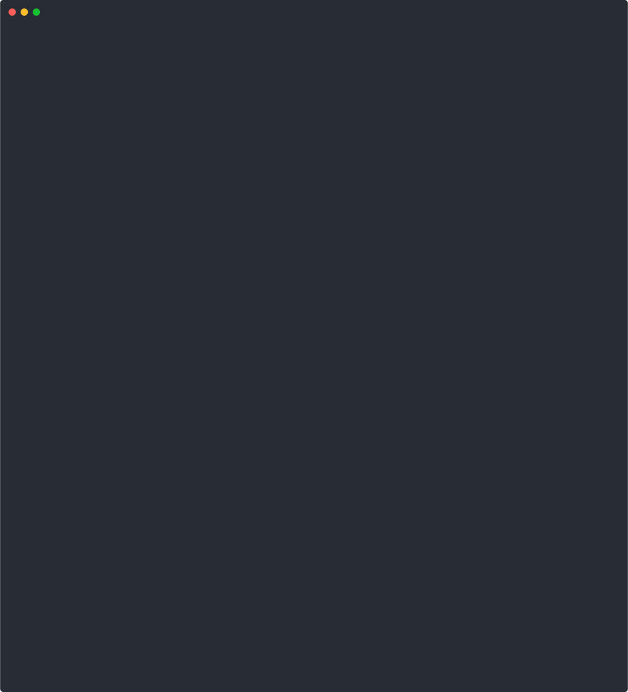

# Confidential `caddy`

This repository demonstrates how to transform the [Caddy](https://caddyserver.com) web
server into a confidential application that runs inside a hardware-protected enclave.
It relies on [golang images](https://github.com/scontain/golang/pkgs/container/golang)
maintained by SCONE in which the Go runtime links against `glibc` or `musl` instead of
invoking Linux system calls directly. These patched images are rebuilt daily from the
official upstream images on Docker Hub.

## Prerequisites

To build and run the confidential version of Caddy you need:

- Docker and Docker Compose
- Access to the images on `registry.scontain.com/scone.cloud` and
  `registry.scontain.com/sconecuratedimages`
- Optional tools such as `wrk` for benchmarking

## Usage

Build the container image and start the confidential Caddy server:

```bash
./build_and_run.sh
```

The script produces both a native and a confidential binary, embeds static content in
the enclave, and launches the service with `docker compose`.

Inside the running container you can execute:

```bash
./run_test.sh
```

to benchmark the native and confidential variants and verify TLS functionality. For
production deployments the sample CAS policy in the script must be extended.

## Repository layout

- `Dockerfile` – builds native and confidential binaries
- `build_and_run.sh` – builds the image and starts the service with `docker compose`
- `run_test.sh` – benchmarking and functional test script
- `docs/demo.svg` – screencast of `build_and_run.sh`

## Screencast

The following screencast demonstrates `build_and_run.sh` in action:



Generate an updated screencast by executing `make`.

